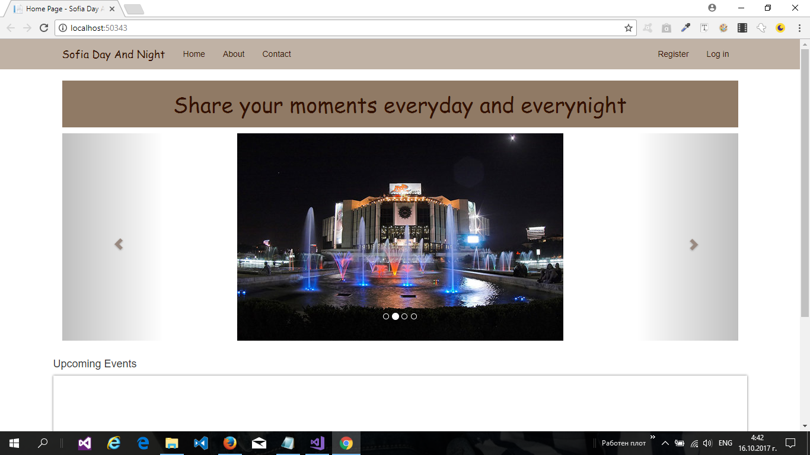
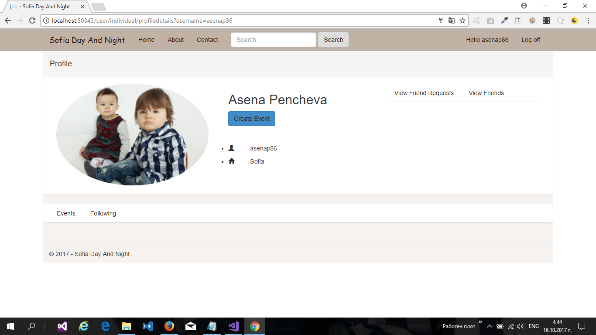
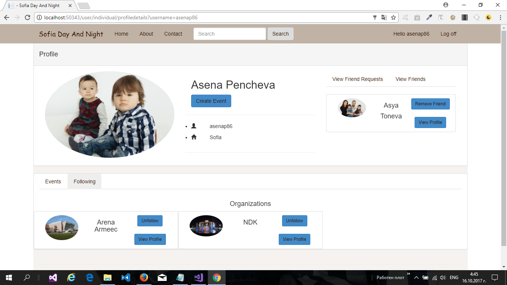
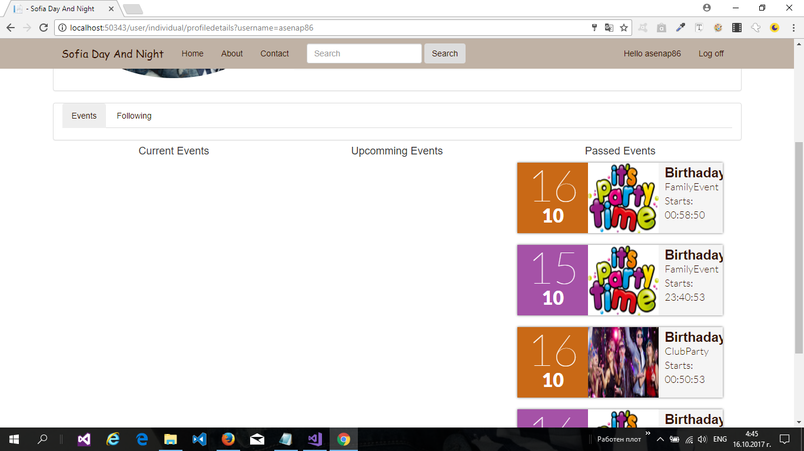
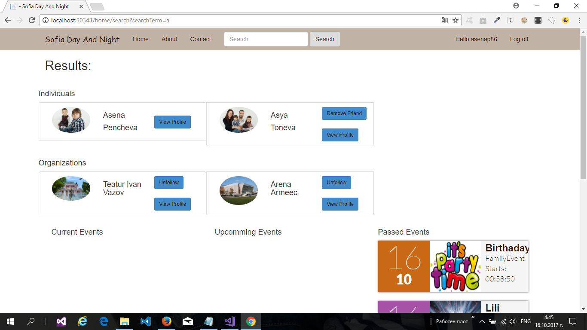
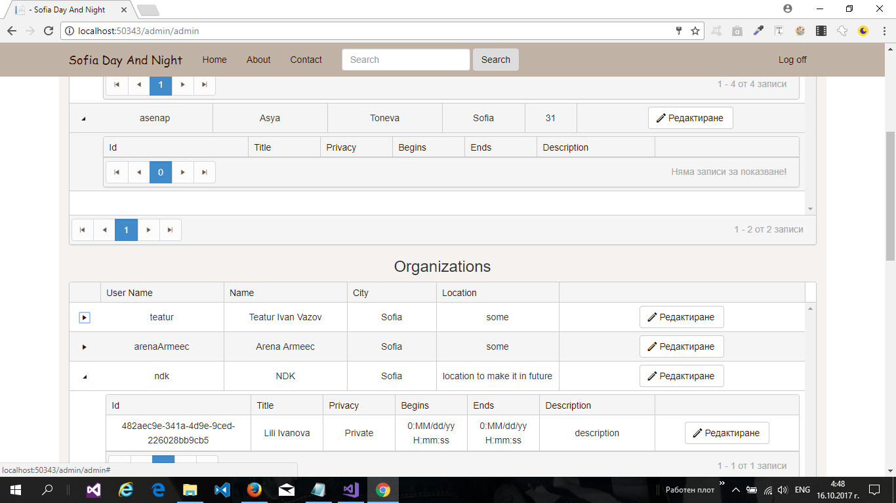

# Sofia Day And Night
<h2>ASP.NET MVC Project</h2>

Sofia Day And Night is a simple social network to share experience from attended events.

   
<h3>Description</h3>

The application has private and public part:

<ol>
<li>
<strong>Public part:</strong> Here not logged users can see some cached upcomming events
</li>
<li>
<strong>Private part:</strong>
<ul>
<li>Common private part: Can be seen from any registrated user. Contains profiles for individuals and organizations.Users can make friends and to follow organization.They also can creaye events and to add images to them. There is a search field where users can find all individuals, organizations and events
</li>
<li>
Admin private part: Can be seen only by users with role Admin. Contains list of all entities. The Admin can edit and to ban or unban them.
</li>
</ul>
</li>
</ol>

<ul>
<li>
All input field have client-side and server-side validation and appropriate error or success messages are displayed to the user
</li>
<li>
File upload of photoes is available for every user.
</li>
<li>
Registration of users in different roles is available
</li>
<h3>Usage of Kendo UI for ASP.NET MVC</h3>

The lib is on trial version and it is not legal to use it unless purchased or also downloaded as trial <a href="http://www.telerik.com/kendo-ui">Kend UI</a>

Screenshots:

